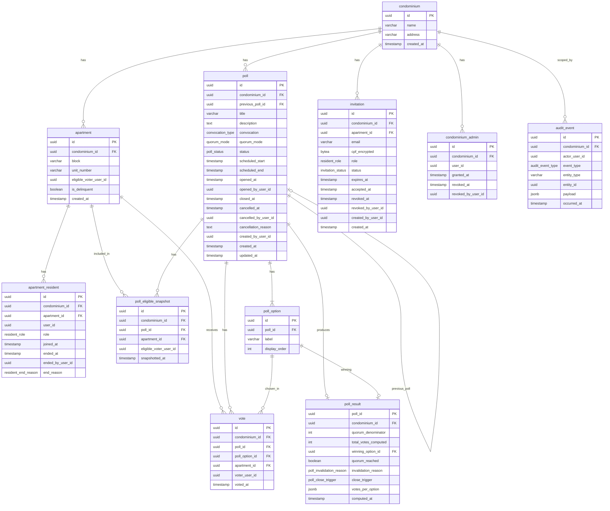

# Condo Vote — Modelagem de Dados

> **Leitura prévia obrigatória:** `docs/condo-vote-principles.md` (spec de negócio).

---

## Organização de Tabelas

O sistema é um **monolito modular** com todas as tabelas no mesmo banco PostgreSQL (Supabase). Autenticação (signup, login, senhas, JWT) é delegada ao **Supabase Auth** (`auth.*` schema, gerenciado pelo Supabase — não editamos diretamente).

| Módulo | Responsabilidade | Tabelas |
|---|---|---|
| **Domínio condominial** | Condomínio, apartamentos, votações, votos, auditoria | `condominium`, `apartment`, `apartment_resident`, `condominium_admin`, `invitation`, `poll`, `poll_option`, `poll_eligible_snapshot`, `vote`, `poll_result`, `audit_event` |
| **Perfil de usuário** | Dados de negócio do user (nome, CPF, consentimento LGPD) | `app_user` |
| **Notificações** | Outbox de e-mails transacionais | `email_notification` |
| **Auth (Supabase)** | Credenciais, JWT, refresh tokens, reset de senha | `auth.users` (gerenciado pelo Supabase — não versionado no Flyway) |

**Referência entre auth e domínio:** `app_user.id` = `auth.users.id` (mesmo UUID, gerado pelo Supabase no signup). Tabelas de domínio referenciam `user_id` sem FK física — validação no service layer.

---

## Diagrama ERD



> Nota: tabelas `app_user` e `email_notification` descritas na seção "Perfil de Usuário e Notificações" abaixo.

---

## Enums PostgreSQL

```sql
-- App Votação
CREATE TYPE resident_role AS ENUM ('OWNER', 'TENANT');

CREATE TYPE resident_end_reason AS ENUM (
    'REMOVED_BY_ADMIN',
    'PROMOTED_TO_OWNER'
);

CREATE TYPE convocation_type AS ENUM ('FIRST', 'SECOND');

CREATE TYPE quorum_mode AS ENUM (
    'SIMPLE_MAJORITY',
    'ABSOLUTE_MAJORITY',
    'QUALIFIED_2_3',
    'QUALIFIED_3_4'
);

CREATE TYPE poll_status AS ENUM (
    'DRAFT',
    'SCHEDULED',
    'OPEN',
    'CLOSED',
    'CANCELLED',
    'INVALIDATED'
);

CREATE TYPE invitation_status AS ENUM (
    'PENDING',
    'ACCEPTED',
    'REVOKED',
    'EXPIRED',
    'BOUNCED'
);

CREATE TYPE poll_invalidation_reason AS ENUM (
    'PRESENCE_QUORUM_NOT_REACHED',
    'NO_OPTION_REACHED_THRESHOLD'
);

CREATE TYPE poll_close_trigger AS ENUM (
    'AUTOMATIC_END_TIME',
    'AUTOMATIC_ALL_VOTED'
);

CREATE TYPE audit_event_type AS ENUM (
    'POLL_CREATED',
    'POLL_SCHEDULED',
    'POLL_CANCELLED',
    'POLL_OPENED_MANUALLY',
    'INVITATION_SENT',
    'INVITATION_REVOKED',
    'ADMIN_GRANTED',
    'ADMIN_REVOKED',
    'APARTMENT_DELINQUENCY_CHANGED',
    'APARTMENT_VOTER_CHANGED',
    'RESIDENT_REMOVED',
    'RESIDENT_PROMOTED_TO_OWNER'
);

-- Notificações
CREATE TYPE email_type AS ENUM (
    'INVITATION',
    'POLL_SCHEDULED',
    'POLL_OPENED',
    'POLL_REMINDER_24H',
    'POLL_CLOSED_RESULT',
    'POLL_INVALIDATED',
    'POLL_CANCELLED',
    'PASSWORD_RESET'
);

CREATE TYPE email_status AS ENUM (
    'PENDING',
    'SENT',
    'FAILED',
    'BOUNCED'
);
```

---

## Tabelas — App Votação

### `condominium`

| Coluna | Tipo | Nullable | Constraints | Descrição |
|--------|------|----------|-------------|-----------|
| id | UUID | NOT NULL | PK, DEFAULT gen_random_uuid() | Identificador único |
| name | VARCHAR(255) | NOT NULL | | Nome do condomínio |
| address | VARCHAR(500) | NOT NULL | | Endereço completo |
| created_at | TIMESTAMP | NOT NULL | DEFAULT now() | Data de criação |

---

### `apartment`

| Coluna | Tipo | Nullable | Constraints | Descrição |
|--------|------|----------|-------------|-----------|
| id | UUID | NOT NULL | PK | Identificador único |
| condominium_id | UUID | NOT NULL | FK → condominium(id) | Tenant |
| block | VARCHAR(50) | NULL | | Torre/bloco (nullable para condos sem torre) |
| unit_number | VARCHAR(20) | NOT NULL | | Número da unidade |
| eligible_voter_user_id | UUID | NULL | | Votante habilitado atual (ref. lógica para `app_user.id`) |
| is_delinquent | BOOLEAN | NOT NULL | DEFAULT false | Unidade inadimplente (bloqueia voto, exclui do quórum) |
| created_at | TIMESTAMP | NOT NULL | DEFAULT now() | Data de criação |

**Índices e constraints:**
- `UNIQUE (condominium_id, COALESCE(block, ''), unit_number)` — unicidade funcional tratando null
- `UNIQUE (id, condominium_id)` — necessário para composite FKs em tabelas filhas (defesa contra mismatch de tenant)
- `idx_apartment_condominium_id ON (condominium_id)` — RLS e queries por tenant

**Invariantes (validados na aplicação — não há trigger):**
- `eligible_voter_user_id` deve ser um `apartment_resident` ativo (`ended_at IS NULL`) deste mesmo apartamento. Mudanças que violem essa regra são rejeitadas no service layer.
- Mudanças em `is_delinquent` ou `eligible_voter_user_id` geram entrada em `audit_event`.

---

### `apartment_resident`

| Coluna | Tipo | Nullable | Constraints | Descrição |
|--------|------|----------|-------------|-----------|
| id | UUID | NOT NULL | PK | Identificador único |
| condominium_id | UUID | NOT NULL | FK → condominium(id) | Tenant |
| apartment_id | UUID | NOT NULL | FK composite → apartment(id, condominium_id) | Apartamento |
| user_id | UUID | NOT NULL | | Morador (ref. lógica para `app_user.id`) |
| role | resident_role | NOT NULL | | OWNER ou TENANT |
| joined_at | TIMESTAMP | NOT NULL | DEFAULT now() | Data de entrada |
| ended_at | TIMESTAMP | NULL | | Data de saída (NULL = ativo) |
| ended_by_user_id | UUID | NULL | | Quem encerrou o vínculo (ref. `app_user.id`) |
| end_reason | resident_end_reason | NULL | | Motivo do encerramento |

**Índices e constraints:**
- `CREATE UNIQUE INDEX ON apartment_resident(apartment_id) WHERE role = 'OWNER' AND ended_at IS NULL` — máx 1 owner ativo por apt
- `idx_apartment_resident_condominium_id ON (condominium_id)` — RLS
- `idx_apartment_resident_user_id ON (user_id)` — busca por usuário
- `CHECK (ended_at IS NULL OR (ended_by_user_id IS NOT NULL AND end_reason IS NOT NULL))` — coerência de encerramento

**Notas:**
- N tenants ativos permitidos por apartamento, mas apenas 1 owner ativo (partial unique index).
- Encerrar vínculo (set `ended_at`) é a operação canônica — não há DELETE.

---

### `condominium_admin`

> Renomeada de `condominium_role`. Como hoje só existe um papel administrativo (síndico), removemos o enum de role. Adicionar outros papéis no futuro pode ser feito com nova tabela ou reintrodução de enum.

| Coluna | Tipo | Nullable | Constraints | Descrição |
|--------|------|----------|-------------|-----------|
| id | UUID | NOT NULL | PK | Identificador único |
| condominium_id | UUID | NOT NULL | FK → condominium(id) | Tenant |
| user_id | UUID | NOT NULL | | Síndico (ref. lógica para `app_user.id`) |
| granted_at | TIMESTAMP | NOT NULL | DEFAULT now() | Data de concessão |
| revoked_at | TIMESTAMP | NULL | | Data de revogação (NULL = ativo) |
| revoked_by_user_id | UUID | NULL | | Quem revogou (superadmin) |

**Índices e constraints:**
- `CREATE UNIQUE INDEX ON condominium_admin(condominium_id, user_id) WHERE revoked_at IS NULL` — um vínculo ativo por usuário por condomínio
- `idx_condominium_admin_condominium_id ON (condominium_id)` — RLS
- `idx_condominium_admin_user_id ON (user_id)` — busca por usuário
- `CHECK (revoked_at IS NULL OR revoked_by_user_id IS NOT NULL)` — quem revogou é obrigatório

**Notas:**
- Múltiplos síndicos ativos permitidos por condomínio.
- Todos os síndicos têm paridade total. A autoria de cada ação é registrada em `created_by_user_id` (poll, invitation), em colunas dedicadas (poll.cancelled_by, etc.) ou em `audit_event`.
- Concessão/revogação do papel é operação de superadmin na v1.

---

### `invitation`

| Coluna | Tipo | Nullable | Constraints | Descrição |
|--------|------|----------|-------------|-----------|
| id | UUID | NOT NULL | PK | Identificador único |
| condominium_id | UUID | NOT NULL | FK → condominium(id) | Tenant |
| apartment_id | UUID | NOT NULL | FK composite → apartment(id, condominium_id) | Apartamento alvo |
| email | VARCHAR(320) | NOT NULL | | E-mail do convidado |
| cpf_encrypted | BYTEA | NULL | | CPF criptografado (obrigatório para TENANT) |
| role | resident_role | NOT NULL | | Papel: OWNER ou TENANT |
| status | invitation_status | NOT NULL | DEFAULT 'PENDING' | Estado atual do convite |
| expires_at | TIMESTAMP | NOT NULL | | Expiração (24h após criação) |
| accepted_at | TIMESTAMP | NULL | | Data de aceitação |
| revoked_at | TIMESTAMP | NULL | | Revogado (manual ou por reenvio) |
| revoked_by_user_id | UUID | NULL | | Quem revogou |
| created_by_user_id | UUID | NOT NULL | | Quem enviou (síndico ou proprietário) |
| created_at | TIMESTAMP | NOT NULL | DEFAULT now() | Data de criação |

**Índices e constraints:**
- `idx_invitation_condominium_id ON (condominium_id)` — RLS
- `CREATE INDEX ON invitation(condominium_id, email) WHERE status = 'PENDING'` — verificação de convite pendente / reenvio
- `CHECK (role = 'OWNER' OR cpf_encrypted IS NOT NULL)` — CPF obrigatório para TENANT
- `CHECK (status != 'ACCEPTED' OR accepted_at IS NOT NULL)`
- `CHECK (status != 'REVOKED' OR revoked_at IS NOT NULL)`

**Token storage (Redis, fora do PG):**
- O token de aceite é um nonce gerado na criação do convite. **Não é persistido em PG.**
- Vive em Redis: chave `invitation:token:{token_plaintext}` → `invitation_id`, com TTL de 24h.
- Aceite: app faz `GET` no Redis → resolve `invitation_id` → carrega registro de PG → valida (`status=PENDING`, `expires_at` no futuro) → atualiza para `ACCEPTED`.
- Single-use: `DEL` da chave após aceite bem-sucedido.

**Reenvio:**
- Sistema seta `status='REVOKED'`, `revoked_at=now()`, `revoked_by_user_id=...` no anterior e cria novo registro PENDING com novo token (novo `SET` em Redis, `DEL` do antigo).

**Expiração:**
- Token vence no Redis automaticamente via TTL.
- Job batch (sugestão: a cada 1h) varre PG por `status=PENDING AND expires_at < now()` e atualiza para `EXPIRED`. Sem isso, o `status` em PG pode ficar desatualizado em relação ao Redis até o próximo batch.

**BOUNCED:**
- Setado pelo módulo `notification/` quando o provider reportar bounce hard. O `EmailSenderJob` atualiza o status da `invitation` correspondente.

---

### `poll`

| Coluna | Tipo | Nullable | Constraints | Descrição |
|--------|------|----------|-------------|-----------|
| id | UUID | NOT NULL | PK | Identificador único |
| condominium_id | UUID | NOT NULL | FK → condominium(id) | Tenant |
| previous_poll_id | UUID | NULL | FK → poll(id) | Poll anterior (ex: Primeira que invalidou; opcional) |
| title | VARCHAR(255) | NOT NULL | | Título da votação |
| description | TEXT | NULL | | Descrição/pauta detalhada |
| convocation | convocation_type | NOT NULL | | Primeira ou Segunda Convocação |
| quorum_mode | quorum_mode | NOT NULL | | Modo de quórum |
| status | poll_status | NOT NULL | DEFAULT 'DRAFT' | Estado atual |
| scheduled_start | TIMESTAMP | NULL | | Início agendado (preenchido a partir de SCHEDULED) |
| scheduled_end | TIMESTAMP | NULL | | Fim agendado (preenchido a partir de SCHEDULED) |
| opened_at | TIMESTAMP | NULL | | Quando abriu de fato (manual ou automático) |
| opened_by_user_id | UUID | NULL | | Síndico que abriu manualmente (NULL se automático) |
| closed_at | TIMESTAMP | NULL | | Quando fechou (CLOSED ou INVALIDATED) |
| cancelled_at | TIMESTAMP | NULL | | Quando foi cancelado |
| cancelled_by_user_id | UUID | NULL | | Síndico que cancelou |
| cancellation_reason | TEXT | NULL | | Motivo do cancelamento |
| created_by_user_id | UUID | NOT NULL | | Síndico criador |
| created_at | TIMESTAMP | NOT NULL | DEFAULT now() | Data de criação |
| updated_at | TIMESTAMP | NOT NULL | DEFAULT now() | Última atualização |

**Índices e constraints:**
- `UNIQUE (id, condominium_id)` — para composite FKs (vote, snapshot)
- `idx_poll_condominium_id ON (condominium_id)` — RLS
- `idx_poll_status ON (condominium_id, status)` — filtragem por estado
- `CHECK (status = 'DRAFT' OR (scheduled_start IS NOT NULL AND scheduled_end IS NOT NULL AND scheduled_end > scheduled_start))`
- `CHECK (status != 'CANCELLED' OR (cancelled_at IS NOT NULL AND cancelled_by_user_id IS NOT NULL AND cancellation_reason IS NOT NULL))`
- `CHECK (status NOT IN ('OPEN','CLOSED','INVALIDATED') OR opened_at IS NOT NULL)`
- `CHECK (status NOT IN ('CLOSED','INVALIDATED') OR closed_at IS NOT NULL)`

**Notas:**
- Polls nunca são deletados (retenção de 5 anos — ver spec §11). `poll_option` tem CASCADE vestigial.
- Abertura/fechamento e cancelamento têm autoria explícita inline para hot-path queries; `audit_event` registra adicionalmente para timeline geral.
- `previous_poll_id` é FK fraca (sem cascade), opcional. Quando uma Segunda Convocação é criada após uma Primeira INVALIDATED, o síndico pode (mas não precisa) referenciar.
- **Quórum de presença (Primeira Convocação):** quando `convocation = FIRST`, o `PollCloserJob` verifica se `total_votes_computed >= ⌊quorum_denominator / 2⌋ + 1` antes de declarar resultado válido. Se não atingir, o poll é INVALIDATED com reason `PRESENCE_QUORUM_NOT_REACHED`. Segunda Convocação não tem quórum de presença. Esta regra é enforçada no service layer (não há CHECK constraint ligando `convocation_type` ao quórum de presença).
- **Todos os campos editáveis enquanto SCHEDULED:** título, descrição, opções, datas, `quorum_mode`, `convocation`. A partir de OPEN, nenhum campo é editável.

---

### `poll_option`

| Coluna | Tipo | Nullable | Constraints | Descrição |
|--------|------|----------|-------------|-----------|
| id | UUID | NOT NULL | PK | Identificador único |
| poll_id | UUID | NOT NULL | FK → poll(id) | Votação |
| label | VARCHAR(500) | NOT NULL | | Texto da opção |
| display_order | INT | NOT NULL | | Ordem de exibição |

**Índices:**
- `UNIQUE (poll_id, display_order)`
- `idx_poll_option_poll_id ON (poll_id)`

**Constraint de aplicação:** mínimo 2 opções por votação (validado no service layer).

**Nota:** opções nunca são deletadas — auditoria preserva pauta original.

---

### `vote`

| Coluna | Tipo | Nullable | Constraints | Descrição |
|--------|------|----------|-------------|-----------|
| id | UUID | NOT NULL | PK | Identificador único |
| condominium_id | UUID | NOT NULL | FK → condominium(id) | Tenant |
| poll_id | UUID | NOT NULL | FK composite → poll(id, condominium_id) | Votação |
| poll_option_id | UUID | NOT NULL | FK → poll_option(id) | Opção escolhida |
| apartment_id | UUID | NOT NULL | FK composite → apartment(id, condominium_id) | Apartamento que votou |
| voter_user_id | UUID | NOT NULL | | Usuário que votou (testemunha — ref. `app_user.id`) |
| voted_at | TIMESTAMP | NOT NULL | DEFAULT now() | Data/hora do voto |

**Índices e constraints:**
- `UNIQUE (poll_id, apartment_id)` — 1 voto por apartamento por votação
- `idx_vote_condominium_id ON (condominium_id)` — RLS
- `idx_vote_poll_id ON (poll_id)` — contagem
- `idx_vote_voter_user_id ON (voter_user_id)` — auditoria por usuário

**Regras:**
- Imutável após registro — sem UPDATE/DELETE pela aplicação.
- Voto pertence ao apartamento; remoção do morador-votante **não invalida** o voto (alinhado com a spec §4 e Código Civil).

---

### `poll_eligible_snapshot`

| Coluna | Tipo | Nullable | Constraints | Descrição |
|--------|------|----------|-------------|-----------|
| id | UUID | NOT NULL | PK | Identificador único |
| condominium_id | UUID | NOT NULL | FK → condominium(id) | Tenant (necessário para RLS) |
| poll_id | UUID | NOT NULL | FK composite → poll(id, condominium_id) | Votação |
| apartment_id | UUID | NOT NULL | FK composite → apartment(id, condominium_id) | Apartamento elegível |
| eligible_voter_user_id | UUID | NOT NULL | | Votante habilitado no momento da abertura (ref. `app_user.id`) |
| snapshotted_at | TIMESTAMP | NOT NULL | DEFAULT now() | Momento do snapshot |

**Índices:**
- `UNIQUE (poll_id, apartment_id)`
- `idx_poll_eligible_snapshot_poll_id ON (poll_id)`
- `idx_poll_eligible_snapshot_condominium_id ON (condominium_id)` — RLS

**Notas:**
- Write-once. Gerado na transição `SCHEDULED → OPEN`. Nunca alterado.
- Apartamentos inadimplentes ou sem `eligible_voter_user_id` na abertura **não são incluídos**.
- Define o denominador para quórum (modos Absoluto e Qualificado) e o quórum de presença (Primeira Convocação).
- **O snapshot é lei:** tanto `apartment_id` quanto `eligible_voter_user_id` são usados na verificação de voto. Se o votante habilitado for removido durante a votação, o apartamento perde o direito de voto nesta votação. Não há fallback para novo votante.

---

### `poll_result`

| Coluna | Tipo | Nullable | Constraints | Descrição |
|--------|------|----------|-------------|-----------|
| poll_id | UUID | NOT NULL | PK, FK → poll(id) | Votação |
| condominium_id | UUID | NOT NULL | FK → condominium(id) | Tenant (RLS) |
| quorum_denominator | INT | NOT NULL | | Tamanho do snapshot na abertura (sempre `|snapshot|`, independente do modo de quórum). Para Maioria Simples, o denominador real do cálculo é `total_votes_computed` — esta coluna serve como referência/auditoria |
| total_votes_computed | INT | NOT NULL | | Total de votos efetivamente registrados |
| winning_option_id | UUID | NULL | FK → poll_option(id) | NULL se INVALIDATED |
| quorum_reached | BOOLEAN | NOT NULL | | Quórum de presença atingido (relevante para Primeira Convocação) |
| invalidation_reason | poll_invalidation_reason | NULL | | Motivo da invalidação (NULL se CLOSED) |
| close_trigger | poll_close_trigger | NOT NULL | | Por que fechou: tempo ou todos votaram |
| votes_per_option | JSONB | NOT NULL | | Agregação `{poll_option_id: count}` para leitura rápida |
| computed_at | TIMESTAMP | NOT NULL | DEFAULT now() | Quando o resultado foi materializado |

**Índices e constraints:**
- `idx_poll_result_condominium_id ON (condominium_id)` — RLS
- `CHECK ((winning_option_id IS NOT NULL AND invalidation_reason IS NULL) OR (winning_option_id IS NULL AND invalidation_reason IS NOT NULL))` — exatamente um dos dois

**Notas:**
- Write-once, gerado na transição para CLOSED ou INVALIDATED.
- `votes_per_option` é cache de agregação para listagens — fonte da verdade continua sendo `vote` (com `UNIQUE (poll_id, apartment_id)` garantindo um voto por apartamento). Discrepâncias se resolvem a favor de `vote`.

---

### `audit_event`

| Coluna | Tipo | Nullable | Constraints | Descrição |
|--------|------|----------|-------------|-----------|
| id | UUID | NOT NULL | PK | Identificador único |
| condominium_id | UUID | NOT NULL | FK → condominium(id) | Tenant (RLS) |
| actor_user_id | UUID | NOT NULL | | Quem executou a ação (ref. `app_user.id`) |
| event_type | audit_event_type | NOT NULL | | Tipo do evento |
| entity_type | VARCHAR(50) | NOT NULL | | Tipo da entidade afetada (ex: 'POLL', 'APARTMENT') |
| entity_id | UUID | NOT NULL | | ID da entidade (sem FK — pode apontar para qualquer tabela) |
| payload | JSONB | NOT NULL | | Contexto: old/new values, campos relevantes |
| occurred_at | TIMESTAMP | NOT NULL | DEFAULT now() | Quando ocorreu |

**Índices:**
- `idx_audit_event_condominium_id ON (condominium_id, occurred_at DESC)` — RLS + timeline
- `idx_audit_event_entity ON (entity_type, entity_id)` — "histórico desta entidade"
- `idx_audit_event_event_type ON (event_type)` — relatórios por tipo

**Eventos cobertos (v1):**
- `POLL_CREATED` — payload: `{title, quorum_mode, convocation}`
- `POLL_SCHEDULED` — payload: `{title, scheduled_start, scheduled_end}`
- `POLL_CANCELLED` — payload: `{cancellation_reason}`
- `POLL_OPENED_MANUALLY` — payload: `{scheduled_start, opened_early_by_seconds}`
- `INVITATION_SENT` — payload: `{email, role, apartment_id}`
- `INVITATION_REVOKED` — payload: `{email, apartment_id, reason}`
- `ADMIN_GRANTED` — payload: `{user_id}`
- `ADMIN_REVOKED` — payload: `{user_id, revoked_by_user_id}`
- `APARTMENT_DELINQUENCY_CHANGED` — payload: `{apartment_id, previous, current}`
- `APARTMENT_VOTER_CHANGED` — payload: `{previous_voter_user_id, new_voter_user_id, change_source}` onde change_source ∈ `OWNER_DELEGATION | OWNER_REVOCATION | INITIAL`
- `RESIDENT_REMOVED` — payload: `{user_id, role, reason}`
- `RESIDENT_PROMOTED_TO_OWNER` — payload: `{user_id, previous_role}`

**Notas:**
- Tabela write-only pela aplicação.
- Cancelamento de poll, abertura manual e remoção de morador também têm autoria inline nas tabelas respectivas (hot-path); `audit_event` é a fonte unificada para timeline e relatórios.

---

## Tabelas — Perfil de Usuário e Notificações

> Tabelas no mesmo banco PostgreSQL (Supabase). Módulos `auth/` e `notification/` no monolito.

### `app_user`

| Coluna | Tipo | Nullable | Constraints | Descrição |
|--------|------|----------|-------------|-----------|
| id | UUID | NOT NULL | PK | Identificador único (consumido pelo app de votação como `user_id`) |
| name | VARCHAR(255) | NOT NULL | | Nome completo |
| email | VARCHAR(320) | NOT NULL | UNIQUE | E-mail (login) |
| cpf_encrypted | BYTEA | NOT NULL | UNIQUE | CPF criptografado AES-256 determinístico (UNIQUE permite anti-fraude) |
| is_active | BOOLEAN | NOT NULL | DEFAULT true | Conta ativa |
| consent_accepted_at | TIMESTAMP | NOT NULL | | Quando aceitou termos/política |
| consent_policy_version | VARCHAR(20) | NOT NULL | | Versão da política aceita |
| created_at | TIMESTAMP | NOT NULL | DEFAULT now() | Data de criação |

**Notas:**
- Senhas gerenciadas pelo **Supabase Auth** (`auth.users.encrypted_password`). Tabela `app_user` não armazena senha.
- `app_user.id` = `auth.users.id` — mesmo UUID, gerado pelo Supabase no signup.
- **Refresh tokens e reset de senha** gerenciados internamente pelo Supabase Auth. Não vivem no nosso Redis.
- Política de retenção LGPD: dados são **mantidos** mesmo após exclusão da conta (auditoria condominial). `is_active = false` desativa o login mas preserva o histórico.
- Quando a política de privacidade evoluir, migrar `consent_*` inline para tabela dedicada `user_consent` com histórico.

---

### `email_notification`

| Coluna | Tipo | Nullable | Constraints | Descrição |
|--------|------|----------|-------------|-----------|
| id | UUID | NOT NULL | PK | Identificador único |
| user_id | UUID | NOT NULL | | Destinatário |
| type | email_type | NOT NULL | | Tipo do e-mail (template a renderizar) |
| payload | JSONB | NOT NULL | | Variáveis para o template (poll_id, etc.) |
| status | email_status | NOT NULL | DEFAULT 'PENDING' | Estado de envio |
| attempts | INT | NOT NULL | DEFAULT 0 | Tentativas de envio |
| last_error | TEXT | NULL | | Última mensagem de erro |
| scheduled_for | TIMESTAMP | NOT NULL | | Quando deve ser enviado (suporta agendamento futuro) |
| sent_at | TIMESTAMP | NULL | | Quando foi efetivamente enviado |
| created_at | TIMESTAMP | NOT NULL | DEFAULT now() | Quando foi enfileirado |

**Índices:**
- `CREATE INDEX ON email_notification(scheduled_for) WHERE status = 'PENDING'` — job pega só pendentes vencidos
- `idx_email_notification_user_id ON (user_id, created_at DESC)` — histórico por usuário

**Padrão transactional outbox:**
- O service de domínio chama `EmailNotificationService.enqueue()` na mesma transação da operação de negócio (ex: criação do poll + agendamento dos e-mails).
- Job assíncrono (`EmailSenderJob`) lê PENDING e envia via provider externo. Falhas → retry com backoff. Bounce hard → status `BOUNCED` e atualização da `invitation` correspondente, se aplicável.

---

## Row-Level Security (RLS)

Todas as tabelas do app de votação com `condominium_id` têm RLS habilitado.

```sql
SET LOCAL app.current_tenant = '<condominium_id>';

CREATE POLICY tenant_isolation ON <table>
    USING (condominium_id = current_setting('app.current_tenant')::uuid);
```

**Tabelas com RLS:** `apartment`, `apartment_resident`, `condominium_admin`, `invitation`, `poll`, `poll_option` (via JOIN com poll), `poll_eligible_snapshot`, `vote`, `poll_result`, `audit_event`

**Tabelas sem RLS:** `condominium` (acesso cross-tenant por superadmin); `app_user` (cross-tenant — perfil do user independe de condomínio); `email_notification` (cross-tenant — notificações são por user, não por condo)

**Composite FKs como defesa adicional:**
- `vote (poll_id, condominium_id) → poll (id, condominium_id)`
- `vote (apartment_id, condominium_id) → apartment (id, condominium_id)`
- `apartment_resident (apartment_id, condominium_id) → apartment (id, condominium_id)`
- `poll_eligible_snapshot (poll_id, condominium_id) → poll (id, condominium_id)`
- `poll_eligible_snapshot (apartment_id, condominium_id) → apartment (id, condominium_id)`
- `invitation (apartment_id, condominium_id) → apartment (id, condominium_id)`

Eliminam a possibilidade de gravar registros com tenant mismatch — defesa em profundidade contra bugs de aplicação.

---

## Dependências Externas

### Redis (Upstash — cache de tokens com TTL)

Tokens efêmeros de convite vivem no Redis para evitar I/O no PostgreSQL e expirar automaticamente via TTL.

| Token | Chave | Valor | TTL | Single-use? |
|------|-------|-------|-----|-------------|
| Convite | `invitation:token:{token}` | `invitation_id` | 24h | Sim (DEL após aceite) |

> **Nota:** Refresh tokens e reset de senha são gerenciados internamente pelo **Supabase Auth** — não passam pelo nosso Redis.

**Trade-offs aceitos:**
- Redis indisponível → convites pendentes invalidados; síndico reenvia. Aceitável dado o ciclo curto (24h).
- Sem auditoria fina de "este token foi usado às X" — `invitation.accepted_at` cobre o aceite.

---

## Convenções de Naming

| Conceito | Coluna | Aplicação |
|---|---|---|
| Vínculo encerrado por fim natural / saída | `ended_at` | `apartment_resident` |
| Permissão/token/registro revogado por ação explícita | `revoked_at` | `condominium_admin`, `invitation` |
| Quem executou a revogação/encerramento | `revoked_by_user_id` / `ended_by_user_id` | par com o respectivo timestamp |
| Quem criou um registro | `created_by_user_id` | `poll`, `invitation` |

---

## Decisões de Modelagem

| Decisão | Justificativa |
|---------|---------------|
| `app_user` e `email_notification` como módulos internos | Perfil de usuário e outbox de email são módulos (`auth/`, `notification/`) dentro do monolito. Autenticação delegada ao Supabase Auth |
| CPF em `app_user`, criptografia determinística | CPF é nacional único; determinístico permite UNIQUE e busca direta. Trade-off: vulnerável a análise de frequência. Aceitável na v1; revisitar se necessário |
| `eligible_voter_user_id` em `apartment` | Acesso direto sem JOIN; integridade garantida no service layer |
| `block` nullable em `apartment` | Nem todo condomínio tem torres |
| `is_delinquent` em `apartment` | Inadimplência é da unidade (Código Civil) |
| Voto sobrevive à remoção do morador | Voto pertence ao apartamento, usuário é testemunha. Removido `is_nullified` |
| `condominium_id` redundante | Necessário para RLS sem JOINs |
| Composite UNIQUE `(id, condominium_id)` | Habilita composite FKs que impedem mismatch de tenant |
| Composite FKs em vote/snapshot/resident/invitation | Defesa em profundidade contra bugs cross-tenant |
| Enums PostgreSQL | Conjuntos fixos pequenos; type safety e performance |
| `ended_at` em vez de soft delete genérico | Mantém histórico de ocupação |
| `condominium_admin` sem coluna role | Hoje só existe síndico; reintroduzir enum quando surgir conselho/subsíndico |
| `poll_eligible_snapshot` write-once | Denominador imutável e auditável |
| TIED removido de `poll_status` | Empate matematicamente impossível em quórum >50%; é caso de INVALIDATED |
| `convocation` em `poll` | Conceito legal brasileiro que afeta validade do resultado |
| `audit_event` central | Volume baixo justifica tabela única; eventos hot-path mantêm colunas inline (poll cancelled_*, opened_*) |
| `poll_result` materializado | Evita recomputação; resultado imutável; `votes_per_option` em JSONB para listagem |
| `previous_poll_id` opcional | Útil para link Primeira → Segunda Convocação; sem obrigar referência |
| `invitation_status` enum + timestamps | Estado explícito + dados temporais; queries simples |
| `invitation.token_hash` (não plaintext) | Dump de banco não expõe convites válidos |
| Outbox de e-mail (`email_notification`) | Atomicidade entre operação de domínio e envio; idempotência; observabilidade |
| Consentimento LGPD inline em `app_user` | Mínimo viável v1; migrar para tabela dedicada quando a política mudar |
