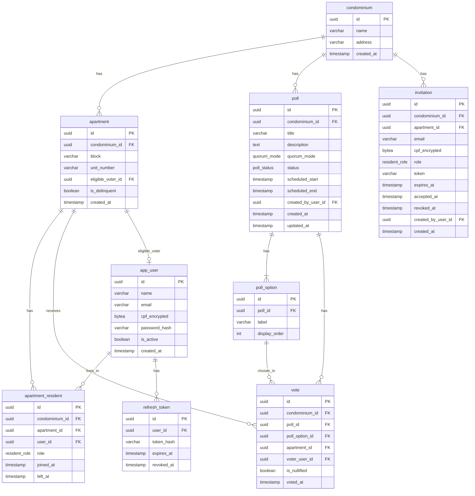

# Condo Vote — Modelagem de Dados

## Diagrama ERD



---

## Enums PostgreSQL

```sql
CREATE TYPE resident_role AS ENUM ('OWNER', 'TENANT');

CREATE TYPE quorum_mode AS ENUM (
    'SIMPLE_MAJORITY',
    'ABSOLUTE_MAJORITY',
    'QUALIFIED_2_3',
    'QUALIFIED_3_4'
);

CREATE TYPE poll_status AS ENUM (
    'DRAFT',
    'SCHEDULED',
    'OPEN',
    'CLOSED',
    'CANCELLED',
    'INVALIDATED',
    'TIED'
);
```

---

## Tabelas

### `condominium`

| Coluna | Tipo | Nullable | Constraints | Descrição |
|--------|------|----------|-------------|-----------|
| id | UUID | NOT NULL | PK, DEFAULT gen_random_uuid() | Identificador único |
| name | VARCHAR(255) | NOT NULL | | Nome do condomínio |
| address | VARCHAR(500) | NOT NULL | | Endereço completo |
| created_at | TIMESTAMP | NOT NULL | DEFAULT now() | Data de criação |

---

### `apartment`

| Coluna | Tipo | Nullable | Constraints | Descrição |
|--------|------|----------|-------------|-----------|
| id | UUID | NOT NULL | PK | Identificador único |
| condominium_id | UUID | NOT NULL | FK → condominium(id) | Tenant |
| block | VARCHAR(50) | NULL | | Torre/bloco (nullable para condos sem torre) |
| unit_number | VARCHAR(20) | NOT NULL | | Número da unidade |
| eligible_voter_id | UUID | NULL | FK → app_user(id) | Votante habilitado atual |
| is_delinquent | BOOLEAN | NOT NULL | DEFAULT false | Unidade inadimplente (bloqueia voto, exclui do quórum) |
| created_at | TIMESTAMP | NOT NULL | DEFAULT now() | Data de criação |

**Índices:**
- `UNIQUE ON (condominium_id, COALESCE(block, ''), unit_number)` — unicidade funcional tratando null
- `idx_apartment_condominium_id ON (condominium_id)` — RLS e queries por tenant

---

### `app_user`

| Coluna | Tipo | Nullable | Constraints | Descrição |
|--------|------|----------|-------------|-----------|
| id | UUID | NOT NULL | PK | Identificador único |
| name | VARCHAR(255) | NOT NULL | | Nome completo |
| email | VARCHAR(320) | NOT NULL | UNIQUE | E-mail (login) |
| cpf_encrypted | BYTEA | NOT NULL | UNIQUE | CPF criptografado em repouso (AES-256) |
| password_hash | VARCHAR(72) | NOT NULL | | Hash BCrypt (custo 10) |
| is_active | BOOLEAN | NOT NULL | DEFAULT true | Conta ativa |
| created_at | TIMESTAMP | NOT NULL | DEFAULT now() | Data de criação |

**Notas:**
- CPF é identificador nacional único — fica no user, não no vínculo com apartamento
- CPF criptografado (não hash) para permitir busca por CPF quando necessário
- Um user pode estar vinculado a múltiplos condomínios via `apartment_resident`

---

### `apartment_resident`

| Coluna | Tipo | Nullable | Constraints | Descrição |
|--------|------|----------|-------------|-----------|
| id | UUID | NOT NULL | PK | Identificador único |
| condominium_id | UUID | NOT NULL | FK → condominium(id) | Tenant |
| apartment_id | UUID | NOT NULL | FK → apartment(id) | Apartamento |
| user_id | UUID | NOT NULL | FK → app_user(id) | Morador |
| role | resident_role | NOT NULL | | OWNER ou TENANT |
| joined_at | TIMESTAMP | NOT NULL | DEFAULT now() | Data de entrada |
| left_at | TIMESTAMP | NULL | | Data de saída (NULL = ativo) |

**Índices:**
- `UNIQUE ON (apartment_id, role) WHERE role = 'OWNER' AND left_at IS NULL` — max 1 owner ativo por apt
- `idx_apartment_resident_condominium_id ON (condominium_id)` — RLS
- `idx_apartment_resident_user_id ON (user_id)` — busca por usuário

**Constraint de aplicação:** N tenants ativos permitidos, mas apenas 1 owner ativo por apartamento (enforced via partial unique index).

---

### `invitation`

| Coluna | Tipo | Nullable | Constraints | Descrição |
|--------|------|----------|-------------|-----------|
| id | UUID | NOT NULL | PK | Identificador único |
| condominium_id | UUID | NOT NULL | FK → condominium(id) | Tenant |
| apartment_id | UUID | NOT NULL | FK → apartment(id) | Apartamento alvo |
| email | VARCHAR(320) | NOT NULL | | E-mail do convidado |
| cpf_encrypted | BYTEA | NULL | | CPF criptografado (obrigatório para TENANT) |
| role | resident_role | NOT NULL | | Papel: OWNER ou TENANT |
| token | VARCHAR(255) | NOT NULL | UNIQUE | Token do convite |
| expires_at | TIMESTAMP | NOT NULL | | Expiração (5 dias após criação) |
| accepted_at | TIMESTAMP | NULL | | Data de aceitação |
| revoked_at | TIMESTAMP | NULL | | Revogado ao reenviar |
| created_by_user_id | UUID | NOT NULL | FK → app_user(id) | Quem enviou (síndico ou proprietário) |
| created_at | TIMESTAMP | NOT NULL | DEFAULT now() | Data de criação |

**Índices:**
- `UNIQUE ON (token)` — busca por token
- `idx_invitation_condominium_id ON (condominium_id)` — RLS

**Regra:** ao reenviar convite, o sistema seta `revoked_at` no anterior e cria novo registro com novo token.

---

### `poll`

| Coluna | Tipo | Nullable | Constraints | Descrição |
|--------|------|----------|-------------|-----------|
| id | UUID | NOT NULL | PK | Identificador único |
| condominium_id | UUID | NOT NULL | FK → condominium(id) | Tenant |
| title | VARCHAR(255) | NOT NULL | | Título da votação |
| description | TEXT | NULL | | Descrição/pauta detalhada |
| quorum_mode | quorum_mode | NOT NULL | | Modo de quórum |
| status | poll_status | NOT NULL | DEFAULT 'DRAFT' | Estado atual |
| scheduled_start | TIMESTAMP | NULL | | Início agendado (preenchido ao agendar) |
| scheduled_end | TIMESTAMP | NULL | | Fim agendado (preenchido ao agendar) |
| created_by_user_id | UUID | NOT NULL | FK → app_user(id) | Síndico criador |
| created_at | TIMESTAMP | NOT NULL | DEFAULT now() | Data de criação |
| updated_at | TIMESTAMP | NOT NULL | DEFAULT now() | Última atualização |

**Índices:**
- `idx_poll_condominium_id ON (condominium_id)` — RLS
- `idx_poll_status ON (condominium_id, status)` — filtrar votações por estado

---

### `poll_option`

| Coluna | Tipo | Nullable | Constraints | Descrição |
|--------|------|----------|-------------|-----------|
| id | UUID | NOT NULL | PK | Identificador único |
| poll_id | UUID | NOT NULL | FK → poll(id) ON DELETE CASCADE | Votação |
| label | VARCHAR(500) | NOT NULL | | Texto da opção |
| display_order | INT | NOT NULL | | Ordem de exibição |

**Índices:**
- `UNIQUE ON (poll_id, display_order)` — ordem sem duplicatas
- `idx_poll_option_poll_id ON (poll_id)` — busca por votação

**Constraint de aplicação:** mínimo 2 opções por votação (validado na camada de aplicação).

---

### `vote`

| Coluna | Tipo | Nullable | Constraints | Descrição |
|--------|------|----------|-------------|-----------|
| id | UUID | NOT NULL | PK | Identificador único |
| condominium_id | UUID | NOT NULL | FK → condominium(id) | Tenant |
| poll_id | UUID | NOT NULL | FK → poll(id) | Votação |
| poll_option_id | UUID | NOT NULL | FK → poll_option(id) | Opção escolhida |
| apartment_id | UUID | NOT NULL | FK → apartment(id) | Apartamento que votou |
| voter_user_id | UUID | NOT NULL | FK → app_user(id) | Usuário que votou |
| is_nullified | BOOLEAN | NOT NULL | DEFAULT false | Voto nulo (morador removido durante votação aberta) |
| voted_at | TIMESTAMP | NOT NULL | DEFAULT now() | Data/hora do voto |

**Índices:**
- `UNIQUE ON (poll_id, apartment_id)` — 1 voto por apartamento por votação
- `idx_vote_condominium_id ON (condominium_id)` — RLS
- `idx_vote_poll_id ON (poll_id)` — contagem de votos

**Regras:**
- Imutável após registro (sem UPDATE/DELETE na aplicação)
- `is_nullified` setado via trigger ou aplicação quando morador é removido

---

### `refresh_token`

| Coluna | Tipo | Nullable | Constraints | Descrição |
|--------|------|----------|-------------|-----------|
| id | UUID | NOT NULL | PK | Identificador único |
| user_id | UUID | NOT NULL | FK → app_user(id) | Usuário |
| token_hash | VARCHAR(64) | NOT NULL | UNIQUE | SHA-256 do token |
| expires_at | TIMESTAMP | NOT NULL | | Expiração (7 dias) |
| revoked_at | TIMESTAMP | NULL | | Revogado na rotação |

**Índices:**
- `UNIQUE ON (token_hash)` — busca por token
- `idx_refresh_token_user_id ON (user_id)` — busca por usuário

---

## Row-Level Security (RLS)

Todas as tabelas com `condominium_id` terão RLS habilitado. O fluxo:

1. Aplicação autentica o usuário via JWT
2. No início de cada transação, seta a variável de sessão:
   ```sql
   SET LOCAL app.current_tenant = '<condominium_id>';
   ```
3. Política RLS em cada tabela:
   ```sql
   CREATE POLICY tenant_isolation ON <table>
       USING (condominium_id = current_setting('app.current_tenant')::uuid);
   ```

**Tabelas com RLS:** apartment, apartment_resident, invitation, poll, poll_option (via JOIN com poll), vote

**Tabelas sem RLS:** app_user (global), refresh_token (global)

---

## Decisões de Modelagem

| Decisão | Justificativa |
|---------|---------------|
| CPF em `app_user`, não em `apartment_resident` | CPF é identificador nacional único por pessoa, independente do condomínio |
| `eligible_voter_id` em `apartment` | Acesso direto ao votante habilitado sem JOIN extra — simplifica queries de quórum e validação de voto |
| `block` nullable em `apartment` | Nem todo condomínio tem torres; evita forçar valor artificial |
| `is_delinquent` em `apartment` | Inadimplência é da unidade, não do morador — alinhado com Código Civil |
| `is_nullified` em `vote` em vez de DELETE | Preserva rastreabilidade para auditoria; votos nunca são deletados |
| `condominium_id` redundante em `vote` e `apartment_resident` | Necessário para RLS funcionar sem JOINs na política |
| Enums PostgreSQL em vez de tabelas de lookup | Conjunto fixo e pequeno de valores; performance superior e type safety |
| `left_at` em `apartment_resident` em vez de soft delete | Mantém histórico de ocupação para auditoria sem flag genérica |
